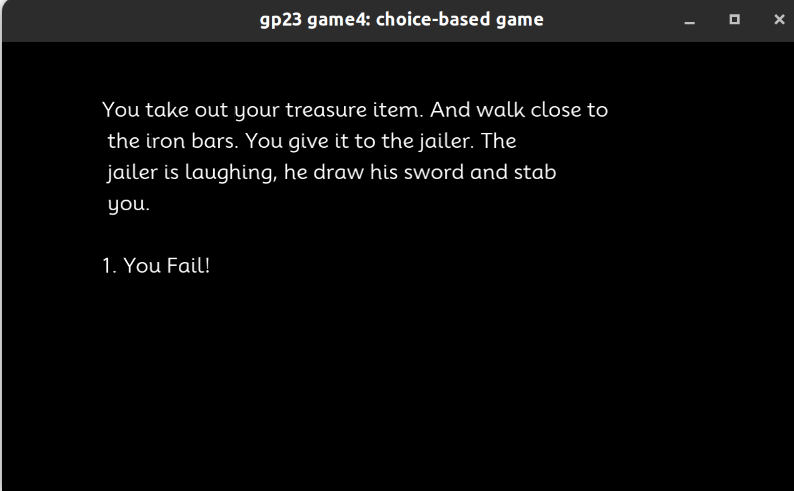

# Jailbreak

Author: Yuan Meng

Design: Simple choice based game that you try to get out of the jail. No time to create 3D models so it is text only. 

Text Drawing: All texts are stored in game, the text drawing pipeline is reading in some text, call harfbuzz and freetype during the runtime and create a set of glyphs for all the text we want to show in this frame. The text drawing pipeline is mostly following [this github repo](https://github.com/tangrams/harfbuzz-example/tree/master). 

Bugs: It looks like the current code suffers from memory leak. I used valgrind to check, but it does not give me meaningful result. It said the leak is only tens of megabytes but the game can actually take up gigabytes of memory. I tried to delete the pointer and gldelete the buffer and texture but the problem remained. Not sure why this happens.

Choices: Use some state data structure. Had no time to implement the if and conditional choices(also don't have very good ideas on this). So just hardcode it. I first used twine to create the story, and made some modifications to the twine file(delete those if... cause I don't have time to implement this). And then use python to parse the file and store different strings to different binary files. At last in C++ use read chunk to read out those binary strings.

Screen Shot:

How To Play:

Press 1,2,3

Sources: 
- https://fonts.google.com/specimen/Mooli

This game was built with [NEST](NEST.md).

